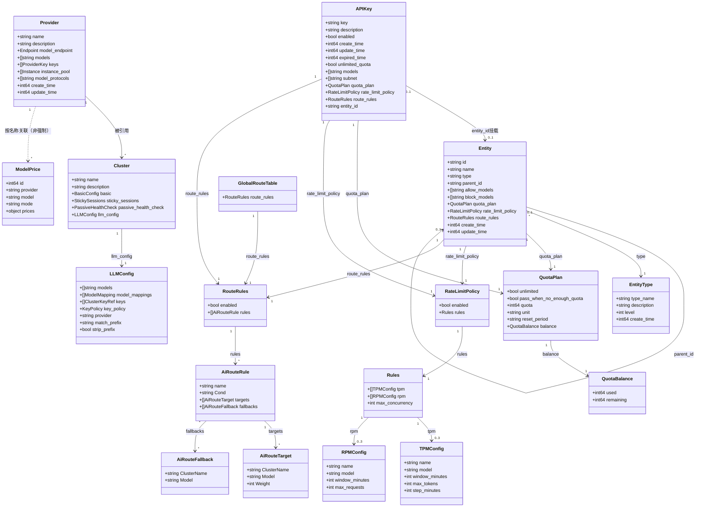

# 对象关系图

**关系说明**

- **API-Key → Entity**：一个API-Key可以挂载到0或1个Entity（通过entity_id）。一个Entity可以被多个API-Key挂载。
- **API-Key → QuotaPlan**：一个API-Key必须拥有1个QuotaPlan（通过嵌套的quota_plan）。若创建时未设置，使用默认值。QuotaPlan的生命周期与API-Key绑定。
- **API-Key → RateLimitPolicy**：一个API-Key必须拥有1个RateLimitPolicy（通过嵌套的rate_limit_policy）。若创建时未设置，使用默认值（enabled=false）。生命周期与API-Key绑定。
- **API-Key → RouteRules**：一个API-Key必须拥有1个RouteRules（通过嵌套的route_rules）。若创建时未设置，使用默认值（enabled=false, rules为空）。生命周期与API-Key绑定。
- **Entity → Entity（parent）**：一个Entity可以有0或1个父Entity，通过parent_id维护。一个Entity可以有多个子Entity。形成树形层级结构。父Entity的Entity-Type的 `level` 必须小于子Entity的Entity-Type的 `level`（数字越小级别越高）。
- **Entity → EntityType**：一个Entity必须属于一个EntityType。一个EntityType可以对应多个Entity。
- **Entity → QuotaPlan**：一个Entity必须拥有1个QuotaPlan（嵌套）。若创建时未设置，使用默认值。生命周期与Entity绑定。
- **Entity → RateLimitPolicy**：一个Entity必须拥有1个RateLimitPolicy（嵌套）。若创建时未设置，使用默认值（enabled=false）。生命周期与Entity绑定。
- **Entity → RouteRules**：一个Entity必须拥有1个RouteRules（嵌套）。若创建时未设置，使用默认值（enabled=false, rules为空）。生命周期与Entity绑定。
- **Entity模型访问控制**：`allow_models`和`block_models`共同决定该Entity及其挂载的API-Key可访问的模型范围。`block_models`优先级高于`allow_models`。
- **QuotaPlan → QuotaBalance**：一个QuotaPlan对应唯一的QuotaBalance（一一对应）。QuotaPlan为静态配置（unlimited、quota、unit、reset_period等），QuotaBalance为动态运行态（used、remaining）。运行时网关扣减操作直接作用于QuotaBalance的remaining。
- **QuotaPlan的balance字段**：为只读字段，反映对应QuotaBalance的used和remaining。`GET /api-keys` 和 `GET /api-keys/{id}` 的返回中 `quota_plan` 已包含 `balance`；独立查询接口（`/api-keys/{id}/quota-plan`、`/entities/{id}/quota-plan`）也返回完整balance。
- **RateLimitPolicy → Rules**：一个RateLimitPolicy包含一组Rules，Rules中可配置tpm（最多3个）、rpm（最多3个）和max_concurrency（默认-1，表示不限制）。
- **运行时层级生效逻辑**：API-Key挂载到Entity后，运行时生效的QuotaPlan和RateLimitPolicy为该API-Key自身直接拥有的 + 该Entity直接拥有的 + 该Entity所有祖先Entity直接拥有的（去重）。
- **GlobalRouteTable → RouteRules → AiRouteRule → AiRouteTarget/AiRouteFallback**：Global路由表通过嵌套的 RouteRules 管理规则，每条规则包含转发目标（targets）和降级目标（fallbacks）。
- **Provider → Cluster**：一个 Provider 可被多个 Cluster 引用；Cluster 通过 `llm_config.provider` 关联 Provider，并只保留“转发策略”。
- **Provider → ModelPrice**：一个 Provider 的名称可被多条 ModelPrice 记录使用；`model-prices.provider` 不强制引用已存在的 Provider。
- **Cluster → LLMConfig**：一个 Cluster 包含 1 个 LLMConfig，用于描述 AI 转发策略（models、key 引用与权重、model_mappings、provider 引用等）。设置 LLMConfig 即开启 AI 网关能力。

