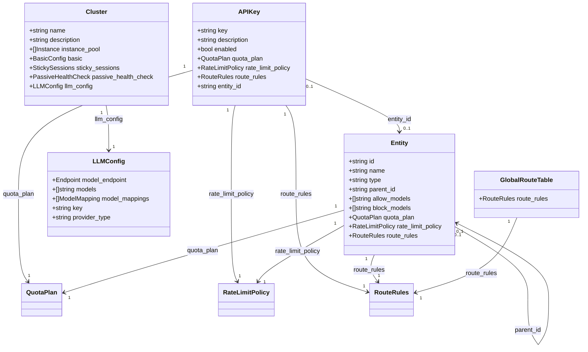

# AI 网关 OpenAPI 优化设计变更说明（v0.3.0）

## 1. 概述

### 1.1 变更背景

`ai-gateway-api` 自基线版本以来，在 OpenAPI 层面沉淀了大量与 AI 网关核心能力弱相关、或过度暴露底层 BFE 实现细节的历史接口。随着产品定位聚焦于 **“AI 模型访问控制、限流、配额与路由”** 四大核心能力，接口定义需要在以下方面做收敛：

1. **屏蔽内部实现细节**：子集群（sub_clusters）、调度器（scheduler）、集群就绪态（ready）等属于 BFE 数据面内部概念，管理面不应直接暴露，避免用户误操作。
2. **降低使用门槛**：集群创建应提供 AI 场景默认参数，用户只需关注实例池与 LLM 配置。
3. **权限模型简化**：当前同时支持 System / Product / Support 三种 Scope，但 Product 权限在前端与自动化场景中并未真正启用，反而增加了 Token 与产品线的绑定复杂度。
4. **补齐运维能力**：API-Key 导入、余额在列表/详情中直接可见、证书详情查询等均为实际运维高频需求。
5. **独立工具类接口**：模型提供商类型与从提供商拉取模型列表属于“工具”性质，应从 `/clusters` 中解耦，便于后续扩展。

### 1.2 目标版本

| 项目 | 说明 |
|------|------|
| 变更日期 | 2026-07-27 |
| 目标版本 | **OpenAPI v0.3.0** |
| 基线文档 | `design-docs/api-define/OpenAPI接口定义.md` |
| 优化文档 | `design-docs/modifications/2026-07-27-openapi-optimize/瑛菲AI网关-OpenAPI接口定义v0.3.0.md` |

### 1.3 设计原则

本次变更遵循以下设计原则：

| 原则 | 说明 |
|------|------|
| **最小暴露面** | 仅保留管理面必需字段与接口，BFE 内部概念下沉到数据面配置导出。 |
| **语义一致** | 接口命名、字段命名、错误码描述与代码实现保持一致；文档与实现冲突时以代码为准并在设计层面说明。 |
| **向后兼容可控** | 被删除的接口在代码中可逐步下线；数据模型尽量保留底层字段，通过接口层过滤实现对外简化。 |
| **默认即推荐** | 集群创建等复杂接口提供 AI 网关场景默认参数，减少用户必填项。 |
| **工具接口独立** | `/model-provider-types`、`/tools` 作为独立工具模块，不依赖产品线上下文。 |

---

## 2. 模块/子系统设计变更

### 2.1 API-Key 管理模块

#### 2.1.1 设计定位

API-Key 仍是请求链路的直接凭证。v0.3.0 在保持“API-Key → QuotaPlan / RateLimitPolicy / RouteRules / Entity”关联关系不变的前提下，重点解决两个使用痛点：

1. **外部系统迁移**：允许在创建时传入已有的 API-Key 字符串，避免重新生成后大量替换客户端。
2. **余额可见性**：列表与详情直接展示 `quota_plan.balance`，减少额外调用 `/api-keys/{id}/quota-plan` 的频率。

#### 2.1.2 核心设计变更

| 变更项 | 旧版设计 | v0.3.0 设计 | 设计说明 |
|--------|----------|-------------|----------|
| 创建时 `key` 字段 | 不支持传入，系统强制生成 | 新增可选 `key` 字段，传入则使用；未传则生成 | 通过全局唯一性校验（`api_key_tokens` / `api_keys.api_key`）保证不冲突；更新时忽略该字段 |
| 列表/详情 `quota_plan` | 旧版文档描述为“不含 balance”，与代码实现不符 | **明确包含 `balance`**（`used`、`remaining`） | 与 `model/icluster_conf/api_key.go` 中 `populateAssociatedData` 行为对齐 |
| 生成接口 `/api-keys/actions/generate` | 存在 | **删除** | 导入机制替代了预览/生成需求，简化接口面 |

#### 2.1.3 对模型层的影响

- `APIKeyParam.Key` 在创建路径中从“只读/系统生成”变为“可写但受唯一性约束”。
- `APIKeyManager.CreateAPIKey` 需要新增对 `api_key` 值全局唯一的校验；当前代码通过 `FetchAPIKeyTokenList` 检查 `api_key_tokens` 表，建议补充对 `api_keys.api_key` 字段的直接唯一索引校验。
- `populateAssociatedData` 已经为列表/详情填充 `QuotaPlan.Balance`，v0.3.0 只需在接口文档中明确此行为，无需修改存储层。

#### 2.1.4 与代码/文档不一致的说明

- **列表返回结构**：`api-changes.md` 明确新版为“分页结构”；但 `瑛菲AI网关-OpenAPI接口定义v0.3.0.md` 第 2.2.2 节写成“Data为数组”。当前代码实现（`endpoints/openapi_v1/api_key/list.go`）实际返回分页结构。设计建议：**以代码实现和 api-changes.md 为准**，v0.3.0 接口文档应修正为分页结构。
- **URI 参数名**：`GET /api-keys/{id}/quota-plan` 的接口定义正文中 URI 参数名为 `id`，但参数表格中写为 `key`。历史版本记录中残留 `/api-keys/{key}/quota-plan` 为笔误。设计建议：**统一使用 `{id}` 作为 URI 参数名**，与代码中 `GetQuotaPlanRoute` 保持一致。

---

### 2.2 Entity/Entity-Type 模块

#### 2.2.1 设计定位

Entity 作为组织架构单元（部门、团队、项目、个人等）的抽象，其层级继承模型（allow_models 交集、block_models 并集、QuotaPlan/RateLimitPolicy/RouteRules 向上收集）是 AI 网关权限与配额体系的核心。v0.3.0 对该模块**不做结构性变更**，仅在接口文档层面进一步澄清。

#### 2.2.2 核心设计变更

| 变更项 | 旧版设计 | v0.3.0 设计 | 设计说明 |
|--------|----------|-------------|----------|
| Entity 列表返回 | 未明确是否分页 | 明确为分页结构（`list` + `pagination`） | 与代码实现对齐 |
| Entity 详情 `quota_plan` | 不含 balance | 不含 balance（独立接口返回） | 保持与 API-Key 一致的设计，但 Entity 列表/详情仍不返回 balance |

#### 2.2.3 对模型层的影响

- `EntityManager` 的层级校验、级联创建/删除逻辑保持不变。
- 建议在 Entity 删除约束中，除“存在子 Entity”和“被 API-Key 挂载”外，未来可考虑增加“存在后代 Entity 被挂载”的显式提示，但 v0.3.0 不强制要求。

---

### 2.3 Cluster 模块

#### 2.3.1 设计定位

Cluster 模块是本次变更中**改动最大**的模块。设计思路从“暴露 BFE 完整集群配置”转向“面向 AI 网关场景的一键集群创建”：

- 用户只需要描述 **实例池（instance_pool）** 和 **LLM 配置（llm_config）**。
- 子集群、调度矩阵、BFE 原生字段由系统在后台自动生成并绑定。
- 不暴露 `ready`、`sub_clusters`、`scheduler` 等运行时或内部字段。

#### 2.3.2 核心设计变更

| 变更项 | 旧版设计 | v0.3.0 设计 | 设计说明 |
|--------|----------|-------------|----------|
| 顶层字段 `ready` | 对外暴露 | **删除** | 就绪状态由数据面自身维护，管理面无需感知 |
| 顶层字段 `sub_clusters` | 对外暴露，可维护 | **删除** | 每个集群固定只有一个子集群，系统自动创建 |
| 顶层字段 `scheduler` | 对外暴露 | **删除** | 固定为 `GSLB_BLACKHOLE=0`，不再开放配置 |
| `Instance.tags` | 暴露 | **删除** | 实例标签在 AI 网关场景暂未使用，简化实例结构 |
| `basic.retries.max_retry_in_subcluster` | 必填 | 重命名为 `max_retry_in_cluster`，底层仍映射原字段 | 命名与子集群对外隐藏一致 |
| `basic.retries.max_retry_cross_subcluster` | 必填 | **删除** | 跨子集群重试在单个子集群模型下无意义 |
| `sticky_sessions.session_sticky_type` | 必填 | **删除** | 默认且仅支持实例级会话保持 |
| `sticky_sessions.enabled` | 不存在 | **新增**，默认 `false` | 显式控制会话保持开关 |
| `passive_health_check` 各字段 | 必填 | **全部改为选填**，并补充默认值 | 降低创建门槛，AI 场景推荐值内置 |
| `llm_config.service_name` / `group` | 必填 | **删除** | 与服务发现解耦，直接通过 `provider_type` + `models` 描述 |
| `llm_config.model_endpoint` | 必填 | **改为可选**，默认 `schema=https`、`uri=/v1/models` | 大多数提供商遵循 OpenAI 兼容格式 |
| `llm_config.enable` | 曾存在后被删除 | 已移除，设置 `llm_config` 即开启 AI 网关能力 | 语义简化 |
| 创建接口必填项 | `basic`、`sticky_sessions`、`passive_health_check` 必填 | `basic`、`sticky_sessions`、`passive_health_check` 改为可选；`llm_config` 改为必填 | 一键创建，默认即推荐 |
| 就绪状态接口 `GET /clusters/{name}/ready` | 存在 | **删除** | 随 `ready` 字段一起移除 |

#### 2.3.3 对模型层的影响

- `ClusterParam` 中对外接口模型与 `clusters` 表存储模型需要解耦：
  - 对外模型：`instance_pool`、`basic`、`sticky_sessions`、`passive_health_check`、`llm_config`。
  - 存储模型：`clusters` 表字段、`sub_clusters` 表、`pools` 表、`lb_matrices` 表。
- `ClusterManager` 的创建流程需要扩展为“一键创建”：
  1. 创建 `clusters` 记录；
  2. 根据 `instance_pool` 创建 `pools` 记录；
  3. 创建 `sub_clusters` 记录并绑定 pool；
  4. 生成默认 `lb_matrices`（`GSLB_BLACKHOLE=0`）。
- 当前 `ClusterManager.DeleteCluster` 已经级联删除子集群与实例池，v0.3.0 保持该设计。
- `storage/rdb/cluster_conf/cluster.go` 中 `LLMConfig` 以 JSON 字符串存储，当前已实现；v0.3.0 只需调整序列化结构（移除 `service_name`、`group`，增加 `provider_type`、`model_mappings` 等）。

#### 2.3.4 对数据面的影响

- `/inner-api/v1/configs/gslb_data/cluster_table` 与 `/configs/gslb_data/gslb` 的导出逻辑**不受影响**，仍然从 `sub_clusters` + `pools` + `lb_matrices` 生成。
- 管理面隐藏 `sub_clusters` 后，数据面仍然需要子集群信息完成转发；只是该信息由系统自动生成，不再由用户维护。

---

### 2.4 Auth 模块

#### 2.4.1 设计定位

v0.3.0 对认证授权模块做**权限模型收敛**：

- 当前代码同时支持 `System`、`Product`、`Support` 三种 Scope，但 Product 权限依赖 `user_products` 表，且需要每个接口显式声明 `FAP`（带产品线校验）。
- 实际运行中，Dashboard 与自动化脚本主要使用 System 权限；BFE/Conf Agent 使用 Support 权限。
- 因此 v0.3.0 暂将用户权限**固定为 System**，Token 权限保留 `System` 与 `Support`，彻底移除 Product Scope 及相关接口。

#### 2.4.2 核心设计变更

| 变更项 | 旧版设计 | v0.3.0 设计 | 设计说明 |
|--------|----------|-------------|----------|
| 用户 `is_admin` | 可选 `true`/`false` | **仅支持 `true`** | 所有用户均为 System 权限 |
| 用户创建 `type` 字段 | 必填（`jwt`/`normal`） | **删除** | 用户类型对管理面无意义 |
| 用户创建 `password` | 条件必填 | **必填** | 简化校验逻辑 |
| Token `scope` | `System` / `Product` / `Support` | **仅 `System` / `Support`** | 移除 Product Scope |
| Token `product_name` | Product Scope 时必填 | **删除** | Token 不再绑定产品线 |
| 用户-产品线绑定接口 | `POST/DELETE /auth/users/{name}/products/{product}` | **删除** | 用户权限收敛为 System，无需产品线绑定 |
| Token-产品线查询接口 | `GET /auth/tokens/actions/search-by-product/{product}` | **删除** | 同上 |
| 用户-产品线查询接口 | `GET /auth/users/actions/search-by-product/{product}` | **删除** | 同上 |
| Session Key 返回 | 含 `is_admin`、`products` | 仅含 `is_admin`（固定 `true`） | 移除 `products` 字段 |

#### 2.4.3 对模型层的影响

- `iauth.UserParam` 中 `Type` 字段可废弃；`Scopes` 固定为 `System`。
- `iauth.TokenParam` 中 `Scope` 枚举收窄；`ProductName` 删除。
- `AuthorizeManager.IsVisitorProductGranted` 在 System 权限下直接放行，Product 路径可保留但不再被 OpenAPI 使用。
- `users` 表与 `user_products` 表结构**无需变更**：`user_products` 表可继续保留供未来多租户扩展，但 v0.3.0 OpenAPI 不再写入。

#### 2.4.4 安全设计说明

- 将用户权限收敛为 System 是一种**短期产品决策**，并非安全架构降级。当前代码中 `ScopeProduct` 的 `scope2permission` 位图已包含常规 CRUD，收敛后通过 Feature-Action 仍可控制管理员操作粒度。
- 若未来需要重新引入 Product Scope，可复用 `user_products` 表与 `FAP` 机制，接口层重新注册即可。

---

### 2.5 Certificates 模块

#### 2.5.1 设计定位

证书模块数据模型本身无变化，但 v0.3.0 补齐了单个证书查询能力，使证书管理接口具备完整的 CRUD 操作集。

#### 2.5.2 核心设计变更

| 变更项 | 旧版设计 | v0.3.0 设计 | 设计说明 |
|--------|----------|-------------|----------|
| 证书详情接口 | 不存在 | **新增 `GET /certificates/{cert_name}`** | 与列表、创建、设置默认、删除组成完整接口集 |

#### 2.5.3 对模型层的影响

- `CertificateManager.FetchCertificate` 已存在，新增端点直接调用即可，无需改动存储层。
- 返回数据继续不包含 `cert_file_content` 与 `key_file_content`，符合安全设计。

---

### 2.6 模型提供商/工具模块

#### 2.6.1 设计定位

原 `/model-providers` 与 `/models` 挂在 `product_cluster` 子包下，语义上属于“集群创建前的辅助工具”。v0.3.0 将其独立为两个模块：

- `/model-provider-types`：枚举系统支持的 AI 模型提供商类型（如 `deepseek`、`openai`、`qwen`）。
- `/tools/get-models-from-provider`：根据用户传入的 endpoint、headers、provider_type 等信息，代理拉取该提供商的模型列表。

#### 2.6.2 核心设计变更

| 变更项 | 旧版设计 | v0.3.0 设计 | 设计说明 |
|--------|----------|-------------|----------|
| 获取提供商列表 | `GET /model-providers`（在 clusters 模块） | **独立为 `GET /model-provider-types`** | 与集群解耦，便于前端下拉框直接使用 |
| 获取模型列表 | `POST /models`（在 clusters 模块） | **独立为 `POST /tools/get-models-from-provider`** | 强调“工具”属性，不直接操作集群资源 |
| 全局模型 `/global-models` | 存在 | **删除** | 全局模型概念与 AI 路由规则解耦，避免歧义 |
| 产品线模型 `/products/{product_name}/models` | 存在 | **删除** | 模型由集群 `llm_config.models` 直接描述，不再按产品线聚合 |

#### 2.6.3 对模型层的影响

- 新增 `model/itool` 或复用 `model/icluster_conf` 中的提供商/模型拉取逻辑。
- 建议将提供商类型配置化（如从配置文件或枚举常量读取），避免硬编码在端点层。
- `/tools/get-models-from-provider` 需要支持 HTTP 代理、超时、IPv6 地址格式化等，建议封装为独立的 ProviderClient，便于后续扩展新的 provider_type。

#### 2.6.4 与 InnerAPI 的关系

- 工具类接口不影响 `/inner-api/v1` 的任何导出配置；它们仅服务于管理面创建/更新集群时的模型选择体验。

---

## 3. 数据模型与存储设计变更

### 3.1 核心数据模型变化

#### 3.1.1 API-Key 模型

```go
// model/icluster_conf/api_key.go
type APIKeyParam struct {
    ID          *string    `json:"id"`
    Enable      *bool      `json:"enabled"`
    // ... 其他字段不变

    Key               *string  `json:"key"`          // 创建时可传入；更新时忽略
    Description       *string  `json:"description,omitempty"`
    UnlimitedQuota    *bool    `json:"unlimited_quota,omitempty"`
    ExpiredTime       *int64   `json:"expired_time,omitempty"`
    Models            []string `json:"models,omitempty"`
    Subnet            []string `json:"subnet,omitempty"`
    EntityID          *string  `json:"entity_id,omitempty"`
    QuotaPlanID       *int64   `json:"quota_plan_id,omitempty"`
    RateLimitPolicyID *int64   `json:"rate_limit_policy_id,omitempty"`
    RouteRulesID      *int64   `json:"route_rules_id,omitempty"`
    ProductName       *string  `json:"-"`
    InnerID           *int64   `json:"-"`
    RemainingQuota    *int64   `json:"remaining_quota,omitempty"`  // 列表/详情实时填充

    QuotaPlan       *shared.QuotaPlanParam       `json:"quota_plan,omitempty"`       // 现在包含 balance
    RateLimitPolicy *shared.RateLimitPolicyParam `json:"rate_limit_policy,omitempty"`
    RouteRules      *shared.RouteRulesParam      `json:"route_rules,omitempty"`
    Entity          *shared.EntitySummary        `json:"entity,omitempty"`
}
```

设计要点：

- `Key` 字段从“系统生成只读”变为“可传入但全局唯一”。
- `RemainingQuota` 字段在列表/详情中通过 `GetRemainingQuota` 从 Redis 实时读取，但**最终对外展示的是 `quota_plan.balance`**，由 `populateAssociatedData` 从 `quota_balances` 表填充。

#### 3.1.2 Cluster 对外模型

v0.3.0 中 Cluster 的对外模型与存储模型解耦，对外模型如下：

```json
{
    "name": "my-cluster",
    "description": "示例集群",
    "instance_pool": [
        {
            "hostname": "backend-1",
            "ip": "10.0.0.1",
            "weight": 50,
            "ports": {"Default": 8080}
        }
    ],
    "basic": {
        "protocol": "http",
        "connection": {
            "max_idle_conn_per_rs": 0,
            "cancel_on_client_close": false
        },
        "retries": {
            "max_retry_in_cluster": 2
        },
        "buffers": {
            "req_write_buffer_size": 512
        },
        "timeouts": {
            "timeout_conn_serv": 50000,
            "timeout_response_header": 50000,
            "timeout_readbody_client": 30000,
            "timeout_read_client_again": 30000,
            "timeout_write_client": 60000
        }
    },
    "sticky_sessions": {
        "enabled": false,
        "hash_strategy": "CLIENT_ID_ONLY",
        "hash_header": "Cookie:USERID"
    },
    "passive_health_check": {
        "interval": 1000,
        "failnum": 3,
        "host": "",
        "uri": "/",
        "statuscode": 0
    },
    "llm_config": {
        "model_endpoint": {
            "schema": "https",
            "uri": "/v1/models",
            "headers": {"Authorization": "Bearer ${API_KEY}"}
        },
        "models": ["deepseek-chat", "deepseek-coder"],
        "model_mappings": [{"key": "gpt-4", "value": "deepseek-chat"}],
        "key": "sk-xxxxxxxxxxxx",
        "provider_type": "deepseek"
    }
}
```

#### 3.1.3 Auth 模型

```go
// 用户创建参数（v0.3.0）
type UserCreateParam struct {
    UserName *string `json:"user_name"`
    Password *string `json:"password"`  // 必填
    IsAdmin  bool    `json:"is_admin"`   // 仅支持 true
    // Type 字段删除
}

// Token 创建参数（v0.3.0）
type TokenCreateParam struct {
    Name  *string `json:"name"`
    Scope *string `json:"scope"`         // System / Support
    // ProductName 字段删除
}
```

### 3.2 数据库表结构变化

#### 3.2.1 无表结构变更的模块

| 模块 | 说明 |
|------|------|
| `api_keys` | 无需新增/删除字段；`api_key` 字段已存在，v0.3.0 只需加强唯一性校验。 |
| `entities` / `entity_types` | 无变更。 |
| `quota_plans` / `quota_balances` | 无变更。 |
| `rate_limit_policies` / `route_rules` | 无变更。 |
| `users` / `user_products` | 无变更；`user_products` 表继续保留供未来扩展，但 v0.3.0 OpenAPI 不再写入。 |
| `certificates` | 无变更。 |

#### 3.2.2 `clusters` 表的对外映射变化

`clusters` 表字段本身**不删除**，因为数据面导出仍需要 `ready`、`hash_strategy`、`session_sticky` 等字段。变化的是**接口层对外暴露的字段子集**：

| 表字段 | 对外状态 | 说明 |
|--------|----------|------|
| `ready` | 隐藏 | 数据库保留，接口不返回 |
| `max_retry_in_cluster` | 通过 `basic.retries.max_retry_in_cluster` 暴露 | 字段名映射 |
| `max_retry_cross_cluster` | 隐藏 | 数据库保留，接口不返回，固定为 0 |
| `session_sticky` | 映射为 `sticky_sessions.enabled` | 新增开关语义 |
| `hash_strategy` / `hash_header` / `cookie_key` | 仅在 `sticky_sessions.enabled=true` 时暴露 | 默认隐藏细节 |
| `healthcheck_*` | 映射为 `passive_health_check.*` | 全部改为可选并带默认值 |
| `llm_config` | 存储 JSON 结构调整 | 移除 `service_name`、`group`、`enable`；新增 `provider_type`、`model_mappings` |

#### 3.2.3 建议的索引补充

v0.3.0 新增“API-Key 值全局唯一”要求，建议对以下字段增加唯一索引：

```sql
-- 已有 api_key_tokens.uk_key，但 api_keys.api_key 当前仅普通索引
ALTER TABLE api_keys ADD UNIQUE KEY uk_api_key (api_key);
```

> 注：当前 `api_key_tokens` 表已有 `idx_key` 唯一索引，但 `api_keys.api_key` 字段没有唯一约束。v0.3.0 设计建议在数据库层补齐唯一索引，与业务层校验形成双重保障。

### 3.3 关联关系变化

#### 3.3.1 对象关系图调整

v0.3.0 对象关系图相较于旧版，主要调整如下：

1. **删除**：`/ai-route-rules`、`/global-models`、`/products/{product_name}/models`、`/general/actions/exec-api` 相关对象。
2. **新增**：`RouteRules` 统一结构明确用于 API-Key、Entity、Global 三级路由表。
3. **细化**：`Cluster` 对象不再包含 `sub_clusters`、`scheduler`、`ready` 等子对象，仅保留 `instance_pool`、`basic`、`sticky_sessions`、`passive_health_check`、`llm_config`。



---

## 4. 接口层设计变更

### 4.1 通用规范变更

#### 4.1.1 返回值格式

| 变更项 | 旧版 | v0.3.0 |
|--------|------|--------|
| `WorkMode` 字段 | 存在 | **移除** |

设计说明：`WorkMode` 是控制台工作模式，与业务数据无关。移除后响应更精简，也减少下游解析负担。

```json
// 旧版
{
    "ErrNum": 200,
    "Data": {},
    "ErrMsg": "success",
    "WorkMode": "ModeNormal"
}

// v0.3.0
{
    "ErrNum": 200,
    "Data": {},
    "ErrMsg": "success"
}
```

#### 4.1.2 错误码调整

| ErrNum | 旧版含义 | v0.3.0 含义 | 变化 |
|--------|----------|-------------|------|
| 401 | 未定义 | **鉴权失败** | 新增 |
| 402 | 没有调用权限 | 没有调用权限造成的失败 | 语义细化 |
| 404 | 查询/修改/删除不存在的对象 | 查询/修改/删除不存在的对象时 | 语义细化 |
| 409 | 资源冲突 | 资源依赖冲突时 | 语义细化 |
| 422 | 参数不合法 | 参数不合法造成的失败 | 语义细化 |
| 500 | 其他业务逻辑错误 | 其他业务逻辑错误，一律返回 500 | 语义细化 |
| 555 | 产品线内重复 | 创建重复对象时 | 语义泛化 |
| 556 | 全局重复 | 数据重复时 | 语义泛化 |

设计说明：

- **401 新增**：将原先混在 402 中的“认证失败”场景独立出来，便于调用方区分“未登录/凭证过期”与“权限不足”。
- **555/556 泛化**：由于 Product Scope 收敛，不再区分“产品线内重复”与“全局重复”，统一按对象重复处理。

### 4.2 新增接口

| 模块 | 接口 | Method | 端点 | 设计用途 |
|------|------|--------|------|----------|
| 模型提供商 | 获取 AI 模型提供商类型列表 | GET | `/model-provider-types` | 前端下拉框、集群 `provider_type` 校验 |
| 工具 | 从指定提供商获取 AI 模型列表 | POST | `/tools/get-models-from-provider` | 集群创建前预览可用模型 |
| 证书 | 证书详情 | GET | `/certificates/{cert_name}` | 补齐证书 CRUD |

### 4.3 删除接口

#### 4.3.1 整模块删除

| 模块 | 删除接口 | 设计原因 |
|------|----------|----------|
| `/ai-route-rules` | `GET /ai-route-rules`<br>`PATCH /ai-route-rules` | AI 路由规则统一由 API-Key / Entity / Global 三级 `RouteRules` 管理，产品级 AI 路由规则概念废弃 |
| `/global-models` | `GET /global-models` | 全局模型概念与 AI 路由解耦，避免歧义 |
| `/products/{product_name}/models` | `GET /products/{product_name}/models` | 模型由集群 `llm_config.models` 描述，不再按产品线聚合 |
| `/general/actions/exec-api` | `POST /general/actions/exec-api` | 通用代理接口与 AI 网关核心能力无关，收敛移除 |

#### 4.3.2 API-Key 删除

| 接口 | 端点 | 设计原因 |
|------|------|----------|
| 生成 API-Key | `GET /api-keys/actions/generate` | 导入机制替代预览/生成需求 |

#### 4.3.3 Cluster 删除/迁移

| 接口 | 端点 | 设计原因 |
|------|------|----------|
| 集群就绪状态获取 | `GET /clusters/{cluster_name}/ready` | `ready` 字段移除 |
| 获取 AI 模型提供商列表 | `GET /model-providers` | 迁移至 `/model-provider-types` |
| 获取 AI 模型列表 | `POST /models` | 迁移至 `/tools/get-models-from-provider` |

#### 4.3.4 Auth 删除

| 接口 | 端点 | 设计原因 |
|------|------|----------|
| 为用户增加某个产品线的授权 | `POST /auth/users/{user_name}/products/{product_name}` | Product Scope 移除 |
| 对用户取消某个产品线的授权 | `DELETE /auth/users/{user_name}/products/{product_name}` | Product Scope 移除 |
| 获取对指定产品线有权限的用户列表 | `GET /auth/users/actions/search-by-product/{product_name}` | Product Scope 移除 |
| 获取对指定产品线有权限的 Token 列表 | `GET /auth/tokens/actions/search-by-product/{product_name}` | Product Scope 移除 |

### 4.4 参数/返回调整的接口

#### 4.4.1 API-Key

| 接口 | 变更项 | 旧版 | v0.3.0 |
|------|--------|------|--------|
| `POST /api-keys` | Body 参数 | 无 `key` | 新增可选 `key` |
| `GET /api-keys` | 返回结构 | 分页结构；旧版文档误写不含 balance | 分页结构；`quota_plan` 含 `balance` |
| `GET /api-keys/{id}` | 返回结构 | 旧版文档描述不含 balance | `quota_plan` 含 `balance` |
| `GET /api-keys/{id}/quota-plan` | 端点笔误 | `/api-keys/{key}/quota-plan` | 统一为 `/api-keys/{id}/quota-plan` |

#### 4.4.2 Cluster

| 接口 | 变更项 | v0.3.0 设计 |
|------|--------|-------------|
| `POST /clusters` | 必填项调整 | `basic`、`sticky_sessions`、`passive_health_check` 改为可选；`llm_config` 改为必填 |
| `GET /clusters` | 返回字段 | 移除 `ready`、`sub_clusters`、`scheduler` |
| `GET /clusters/{cluster_name}` | 返回字段 | 移除 `ready`、`sub_clusters`、`scheduler` |
| `PATCH /clusters/{cluster_name}` | 可修改字段 | 不再支持修改 `sub_clusters` / `scheduler`，通过 `instance_pool` 调整实例 |
| `DELETE /clusters/{cluster_name}` | 返回字段 | 返回创建接口同结构（已移除系统内部字段） |

#### 4.4.3 Auth

| 接口 | 变更项 | 旧版 | v0.3.0 |
|------|--------|------|--------|
| `POST /auth/users` | Body 参数 | `password` 条件必填；`is_admin` 可选；有 `type` 字段 | `password` 必填；`is_admin` 选填但固定 `true`；删除 `type` |
| `GET /auth/users` | 返回字段 | 含 `user_name`、`is_admin`、`products` | 仅含 `user_name`、`is_admin`（固定 `true`） |
| `PATCH /auth/users/{user_name}/is_admin` | Body 参数 | `is_admin` 可设置为 `true`/`false` | `is_admin` 固定为 `true` |
| `POST /auth/session-keys` | 返回字段 | 含 `is_admin`、`products` | `is_admin` 固定返回 `true`，删除 `products` |
| `POST /auth/tokens` | Body 参数 | 含 `name`、`scope`、`product_name` | 删除 `product_name`，`scope` 仅支持 `System`/`Support` |
| `GET /auth/tokens/{token_name}` | 返回字段 | 含 `name`、`product_name`、`token`、`scope` | 删除 `product_name` |
| `GET /auth/tokens` | 返回字段 | 元素含 `product_name` | 删除 `product_name` |

### 4.5 接口层路由注册调整

`endpoints/openapi_v1/endpoints.go` 中 `endpoints()` 函数需要相应调整：

```go
func endpoints() []*xreq.Endpoint {
    return merge(
        product.Routers,                    // 保留（产品线管理）
        product_cluster.Endpoints,          // 精简：移除 model-providers、models
        certificate.Endpoints,              // 新增证书详情
        product_pool.Endpoints,             // 保留
        subcluster.Endpoints,               // 保留但对外空切片（当前未注册）
        bfe_pool.Endpoints,                 // 保留
        auth.Endpoints,                     // 精简：移除 product 相关端点
        traffic.Endpoints,                  // 保留
        bfe_cluster.Endpoints,              // 保留但对外空切片
        route.Endpoints,                    // 保留（表达式校验）
        domain.Endpoints,                   // 保留但对外空切片
        api_key.Endpoints,                  // 移除 generate 端点
        ai_route.Endpoints,                 // 考虑移除（/ai-route-rules 下线）
        general.Endpoints,                  // 考虑移除（/exec-api 下线）
        entity_type.Endpoints,              // 保留
        entity.Endpoints,                   // 保留
        global_route_rules.Endpoints,       // 保留
        route_tables.Endpoints,             // 保留
        models.Endpoints,                   // 移除（/global-models 下线）
        model_provider_type.Endpoints,      // 新增
        tool.Endpoints,                     // 新增
    )
}
```

> 注：`product_pool`、`subcluster`、`traffic`、`bfe_cluster`、`domain` 等子包当前导出的 `Endpoints` 切片为空或对应接口未实际注册，v0.3.0 可继续保留代码文件，但不应在 OpenAPI 中暴露未完成的功能。

---

## 5. 关键业务逻辑/流程变更

### 5.1 模型访问控制

v0.3.0 的模型访问控制逻辑**保持不变**，仅在接口文档中进一步明确：

1. **API-Key 自身 `models`**：白名单机制，`*` 表示不限制。
2. **Entity 层级 `allow_models`**：检查链中所有 Entity 的 `allow_models` 取交集。
3. **Entity 层级 `block_models`**：黑名单优先，任一 Entity（含祖先）命中即拒绝。
4. **API-Key 与 Entity 取交集**：若 API-Key 自身设置了非 `*` 的 `models`，则与 Entity 继承结果取交集；交集为空则该 Key 被禁用。

设计说明：该流程已在 `model/imods/mod_api_key_rule.go` 的导出逻辑中实现，v0.3.0 无需修改核心算法，只需确保删除 `/global-models` 后，前端不再依赖其进行模型选择。

### 5.2 限流策略

v0.3.0 的限流策略设计**保持不变**：

- API-Key 与 Entity 层级向上的限流策略通过 `RateLimitPolicyManager` 收集并导出为 `rate_limit_policies.json` 与 `api_key_rl_policy_bindings.json`。
- 策略命名继续采用 `rlp-<policy_id>` 格式。
- 运行时顺序仍为：模型访问控制检查 → 限流检查 → 配额扣减。

设计建议：随着 Product Scope 移除，限流策略的 `product_name` 字段在 `rate_limit_policies` 表中仍可保留，但 OpenAPI 不再要求传入，建议默认填充为 `AI_product`。

### 5.3 配额扣减与余额同步

v0.3.0 的配额体系设计**保持不变**，但需关注以下与 API-Key 相关的调整：

1. **创建 API-Key 时传入 `key`**：
   - 若传入的 `key` 在 Redis 中已存在（例如从其他系统导入），应通过 `IncrBy(delta)` 将 Redis 值调整为新的 `quota`，而不是直接覆盖。
   - 当前 `APIKeyCreateProcess` 已实现该逻辑（读取当前值 → 计算 delta → `IncrBy`）。
2. **列表/详情返回 `balance`**：
   - 当前 `populateAssociatedData` 从 `quota_balances` 表读取，存在最长 1 分钟的同步延迟。
   - v0.3.0 文档明确返回 `balance` 后，调用方应理解其“准实时”特性；若需要实时剩余量，应直接读取 Redis 或网关层接口。
3. **手动重置与周期重置**：
   - 继续通过 `QuotaPlanManager.ResetBalance` 执行，使用 `IncrBy(delta)` 保证并发安全。

### 5.4 配置级联与隔离

v0.3.0 的配置级联与隔离逻辑**保持不变**，核心规则如下：

| 变更操作 | 级联影响 | 隔离机制 |
|----------|----------|----------|
| 修改 API-Key 的 `quota_plan` | 实时生效 | 旧资源若不被其他 API-Key/Entity 引用则级联删除 |
| 修改 API-Key 的 `rate_limit_policy` | 实时生效 | 旧资源若不被引用则级联删除 |
| 修改 API-Key 的 `route_rules` | 实时生效 | 更新底层资源，旧资源若不被引用则级联删除 |
| 修改 API-Key 的 `entity_id` | 实时生效 | 旧挂载关系立即解除，无残留 |
| 修改 Entity 的 `parent_id` | 实时生效 | 禁止 level 违反层级关系的修改 |
| 删除 Entity | 必须先解绑所有 API-Key 且无子 Entity | 级联删除其专属资源 |
| 删除 API-Key | 级联删除其 quota_plan、rate_limit_policy 及底层资源 | 引用计数管理 |

### 5.5 Cluster 创建/更新/删除的级联流程

v0.3.0 需要新增/调整 Cluster 的生命周期流程：

#### 5.5.1 创建流程

```text
POST /clusters
  ├─ 校验 name 全局唯一
  ├─ 校验 instance_pool 非空、端口包含 Default、权重合法
  ├─ 校验 llm_config 必填、models 非空、provider_type 合法
  ├─ 为 basic / sticky_sessions / passive_health_check 填充 AI 网关默认值
  ├─ 写入 clusters 表（llm_config 序列化为 JSON）
  ├─ 创建 pools 表记录：name={product_name}.{cluster_name}
  ├─ 创建 sub_clusters 表记录：name={cluster_name}，绑定 pool
  ├─ 创建 lb_matrices 记录：默认 GSLB_BLACKHOLE=0
  └─ 返回对外模型（不含 ready/sub_clusters/scheduler）
```

#### 5.5.2 更新流程

```text
PATCH /clusters/{cluster_name}
  ├─ 校验 cluster 存在
  ├─ 若传入 instance_pool：
  │   ├─ 更新 pools.instance_detail
  │   ├─ 更新 lb_matrices
  │   └─ 子集群名称保持不变
  ├─ 若传入 basic / sticky_sessions / passive_health_check / llm_config：
  │   └─ 更新 clusters 表对应字段
  └─ 返回对外模型
```

#### 5.5.3 删除流程

```text
DELETE /clusters/{cluster_name}
  ├─ 查询 cluster 关联的 sub_clusters
  ├─ 对每个 sub_cluster：
  │   ├─ 解绑 lb_matrices
  │   ├─ 删除 sub_cluster
  │   └─ 删除关联 pool
  ├─ 删除 cluster
  └─ 返回已删除集群的对外模型
```

设计说明：当前 `ClusterManager.DeleteCluster` 已遍历并级联删除子集群及其实例池，v0.3.0 可直接复用，但需调整返回数据结构。

---

## 6. 兼容性/影响分析

### 6.1 对前端/客户端的影响

| 影响点 | 说明 | 建议 |
|--------|------|------|
| `WorkMode` 字段移除 | 前端若解析该字段需移除 | 统一从响应中移除 `WorkMode` 解析 |
| 401 错误码新增 | 前端需要新增对 401 的处理 | 401 时跳转登录；402 时提示无权限 |
| API-Key 列表返回 `balance` | 前端可直接展示余额，无需二次请求 | 列表页展示 `used/remaining`，详情页同 |
| Cluster 创建表单简化 | `basic`、`sticky_sessions`、`passive_health_check` 改为可选 | 前端可提供“高级选项”折叠面板，默认不展开 |
| Cluster 详情/列表字段减少 | `ready`、`sub_clusters`、`scheduler` 不再返回 | 移除前端对应展示；状态监控改为调用 BFE 数据面接口 |
| `/model-providers` → `/model-provider-types` | 前端下拉框数据源需更新 | 更新 URL 与返回结构（字符串数组） |
| `/models` → `/tools/get-models-from-provider` | 模型选择弹窗需更新 | Body 参数增加 `schema`、`hosts`、`headers`、`provider_type` |
| Auth 用户列表移除 `products` | 用户管理页不再展示产品线 | 移除相关列与绑定/解绑按钮 |
| Token 创建移除 `product_name` | Token 管理表单简化 | 仅保留 `name`、`scope` |
| 删除 `/ai-route-rules`、`/global-models`、`/exec-api` | 前端对应菜单/按钮移除 | 确认无引用后直接下线 |

### 6.2 对数据面/控制面的影响

| 影响点 | 说明 |
|--------|------|
| InnerAPI 导出格式 | `/inner-api/v1/configs/mod-api-key`、`rate-limit-policy`、`ai-route` 的导出结构**不变**，因为底层 `api_keys`、`entities`、`quota_plans`、`rate_limit_policies`、`route_rules` 表结构未变。 |
| Cluster 导出 | `/configs/gslb_data/cluster_table`、`/configs/gslb_data/gslb`、`/configs/tls_conf/server_data_conf` 仍然依赖 `clusters`、`sub_clusters`、`pools`、`lb_matrices` 表。管理面隐藏 `sub_clusters` 后，数据面配置生成逻辑保持不变。 |
| BFE 配置重载 | Cluster 更新时，若 `instance_pool` 变化，会触发 `config_versions` 版本更新，Conf Agent 会拉取新的 cluster_table 与 gslb 配置。 |
| 配额同步 | API-Key 导入时，Redis Key 可能已存在，`IncrBy(delta)` 机制保证不会覆盖已有计数。 |

### 6.3 向后兼容性说明

| 维度 | 兼容性说明 |
|------|------------|
| 数据库 schema | **完全兼容**。v0.3.0 不删除任何表或字段，所有变更通过接口层字段过滤与映射实现。 |
| OpenAPI 接口 | **不完全兼容**。被删除的接口将返回 404；返回结构移除 `WorkMode`；部分字段必填性变化。 |
| 客户端 SDK | 需要升级以适配 v0.3.0。建议提供变更清单与迁移指南。 |
| 数据面配置 | **向前兼容**。BFE 不需要感知管理面接口变化。 |
| 权限模型 | System 用户与 Support Token 不受影响；Product Scope Token 在 v0.3.0 中无法创建，但已有 Token 仍可通过数据库 `scopes` 字段生效，建议在升级前清理或重新生成。 |

### 6.4 风险提示与建议

| 风险点 | 说明 | 建议 |
|--------|------|------|
| API-Key 全局唯一性 | 当前 `api_keys.api_key` 无唯一索引，仅靠业务层校验可能存在并发窗口 | 增加数据库唯一索引 `uk_api_key` |
| Cluster 创建失败回滚 | 一键创建涉及多个表，若中间步骤失败需保证事务回滚 | 确保整个流程包裹在 `TxnStorager.AtomExecute` 中 |
| `passive_health_check` 默认值 | 旧版数据库字段默认 `failnum=10`，v0.3.0 推荐默认 `failnum=3` | 接口层默认值与数据库默认值需统一，避免混淆 |
| `quota_plan.balance` 时效性 | 列表/详情返回的 balance 来自数据库，非 Redis 实时值 | 文档明确说明；高实时性场景建议网关层暴露独立接口 |
| 文档与实现不一致 | `瑛菲AI网关-OpenAPI接口定义v0.3.0.md` 中 API-Key 列表返回写成“Data为数组”，与代码实现的分页结构冲突 | 以代码实现和 `api-changes.md` 为准，修正接口文档 |
| Auth Product 路径遗留代码 | `user_products` 相关接口与表保留但不再使用 | 建议在 v0.4.0 中彻底清理，避免维护负担 |

---

## 7. 版本修改记录摘要

### v0.3.0 主要设计变更点

| 类别 | 变更点 |
|------|--------|
| **模块增删** | 新增 `/model-provider-types`、`/tools`；删除 `/ai-route-rules`、`/global-models`、`/products/{product_name}/models`、`/general/actions/exec-api` |
| **通用规范** | 返回值移除 `WorkMode`；新增错误码 401；细化错误码描述 |
| **API-Key** | 创建支持导入外部 `key`；列表/详情 `quota_plan` 包含 `balance`；删除 `/api-keys/actions/generate` |
| **Auth** | 用户 `is_admin` 仅支持 `true`；Token 删除 `product_name`，`scope` 仅保留 `System`/`Support`；删除产品线授权相关接口 |
| **Cluster** | 删除 `ready`、`sub_clusters`、`scheduler` 对外暴露；`Instance` 删除 `tags`；`sticky_sessions` 删除 `session_sticky_type`，新增 `enabled`；`retries` 重命名 `max_retry_in_subcluster` → `max_retry_in_cluster`；`passive_health_check` 全字段选填并补充默认值；`llm_config` 删除 `service_name`、`group`，`model_endpoint` 改为可选 |
| **Certificates** | 新增 `GET /certificates/{cert_name}` |
| **数据模型** | 对外 Cluster 模型与存储模型解耦；Auth 模型收敛；API-Key `Key` 字段可传入 |
| **存储层** | 建议补充 `api_keys.api_key` 唯一索引；其余表结构不变 |
| **业务流程** | Cluster 创建/更新/删除增加自动子集群/实例池/调度矩阵维护；其余核心流程不变 |

---

## 8. 相关文档索引

| 文档 | 路径 |
|------|------|
| API 变更说明 | `design-docs/modifications/2026-07-27-openapi-optimize/api-changes.md` |
| v0.3.0 接口定义 | `design-docs/modifications/2026-07-27-openapi-optimize/瑛菲AI网关-OpenAPI接口定义v0.3.0.md` |
| 旧版 OpenAPI 接口定义 | `design-docs/api-define/OpenAPI接口定义.md` |
| InnerAPI 接口定义 | `design-docs/api-define/InnerAPI接口定义.md` |
| 总体设计文档 | `design-docs/sys-design/总体设计文档.md` |
| 接口层设计文档 | `design-docs/sys-design/接口层设计文档.md` |
| 模型层设计文档 | `design-docs/sys-design/模型层设计文档.md` |
| 存储层设计文档 | `design-docs/sys-design/存储层设计文档.md` |
| 数据库设计文档 | `design-docs/sys-design/数据库设计文档.md` |
| API-Key 与 Entity 关联 | `design-docs/sys-design/details/API-Key与Entity关联及模型继承.md` |
| 限流策略与导出 | `design-docs/sys-design/details/限流策略与导出.md` |
| 路由规则管理 | `design-docs/sys-design/details/路由规则管理.md` |
| 认证授权机制 | `design-docs/sys-design/details/认证授权机制.md` |
| 配额余额同步机制 | `design-docs/sys-design/details/配额余额同步机制.md` |
| InnerAPI 配置导出 | `design-docs/sys-design/details/InnerAPI配置导出与版本控制.md` |

---

*文档生成日期：2026-07-27*
*目标版本：OpenAPI v0.3.0*
