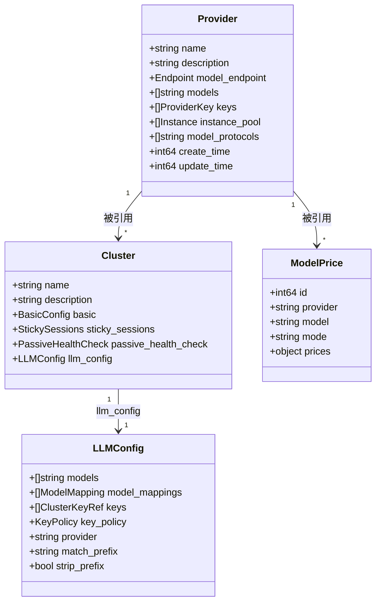

# Provider 与 Cluster 概念分离——设计变更说明

## 1. 概念定义

| 概念 | 定义 | 类比 |
|------|------|------|
| **Provider** | 一个模型提供方，包含接入端点、可用模型、API Key、实例池、支持的协议。 | 类似“上游账号/租户”。 |
| **Cluster** | 一个转发集群，决定把流量按什么模型、什么权重、什么策略转发到某个 provider。 | 类似“虚拟集群/路由视图”。 |
| **Model Price** | 一个 (provider, model, mode) 的价格记录，`provider` 必须引用已存在的 provider。 | 保持不变，仅收紧引用。 |

## 2. 数据模型变更

### 2.1 新增 Provider 模型

```json
{
  "name": "deepseek",
  "description": "DeepSeek 官方 API",
  "model_endpoint": { "schema": "https", "uri": "/v1/models" },
  "models": ["deepseek-chat", "deepseek-coder"],
  "keys": [
    {"name": "key-primary", "key": "sk-aaaaaaaaaaaa"},
    {"name": "key-secondary", "key": "sk-bbbbbbbbbbbb"}
  ],
  "instance_pool": [
    { "name": "backend-1", "addr": "api.deepseek.com", "weight": 100, "port": 443 }
  ],
  "model_protocols": ["openai"],
  "create_time": 1716883200,
  "update_time": 1716883200
}
```

### 2.2 Cluster 模型变更

| 变更 | 字段 | 说明 |
|------|------|------|
| 移除（顶层） | `instance_pool` | 下沉到 provider。 |
| 移除（`llm_config`） | `model_endpoint` | 下沉到 provider。 |
| 移除（`llm_config`） | `provider_type` | 由 provider 的 `model_protocols` 替代。 |
| 改造（`llm_config.keys`） | `keys` | 只保留 `name` + `weight`，`name` 必须对应 provider 中存在的 key。 |
| 改造（`llm_config.models`） | `models` | 含义变为 cluster 可转发的模型，须为 provider `models` 子集。 |
| 强化（`llm_config.provider`） | `provider` | 必填，且必须引用已存在的 provider。 |
| 保留 | `model_mappings`、`key_policy`、`match_prefix`、`strip_prefix` | 行为不变。 |

### 2.3 Model-Price 模型变更

| 变更 | 字段 | 说明 |
|------|------|------|
| 强化 | `provider` | 必须引用 `/providers` 中已存在的 provider。 |

## 3. 存储层变更

1. **新增 provider 表/实体/DAO**
   - 存储 provider 全部字段。
   - 提供按 name 查询、列表查询、存在性检查。

2. **修改 cluster 表**
   - 移除 `instance_pool` 字段的持久化。
   - 移除 `llm_config.model_endpoint`、`llm_config.provider_type` 的持久化。
   - 将 `llm_config.keys` 改为 `{name, weight}` 结构。

3. **修改 model-prices 表/校验层**
   - 增加 provider 引用校验（或在校验层实现）。

## 4. 对 BFE 配置生成的影响

**本次重构对 BFE 数据面无影响。**

`ai-gateway-api` 在生成 BFE 配置时，内部完成如下转换：

| BFE 配置项 | 来源（新模型） | 说明 |
|------------|----------------|------|
| 实例池 / 子集群 / 集群 | `cluster` + `provider.instance_pool` | 从 provider 读取实例池，按原规则生成。 |
| `AIConf.Models` | `cluster.llm_config.models` | 不变。 |
| `AIConf.ModelMappings` | `cluster.llm_config.model_mappings` | 不变。 |
| `AIConf.Keys` | `provider.keys`（取 key 明文） + `cluster.llm_config.keys`（取 weight） | 按 name 做 join，生成带 weight 的 key 列表。 |
| `AIConf.KeyPolicy` | `cluster.llm_config.key_policy` | 不变。 |
| `AIConf.Provider` | `cluster.llm_config.provider` | 不变，仍用于 model-prices 查找与成本计算。 |
| `AIConf.MatchPrefix` / `StripPrefix` | `cluster.llm_config.match_prefix` / `strip_prefix` | 不变。 |
| `AIConf.ModelTable` | 由 `provider` 查询 `model-prices` 自动填充 | 不变。 |

## 5. 数据迁移方案

### 5.1 存量数据问题

现有 `/clusters` 数据包含：

- 顶层 `instance_pool`
- `llm_config.model_endpoint`
- `llm_config.provider_type`
- `llm_config.keys[].key`

### 5.2 自动迁移策略（推荐）

1. 升级脚本扫描现有 cluster 记录。
2. 以 `cluster.llm_config.provider`（或 fallback 到 `provider_type`）作为 provider name。
3. 若该 provider 不存在，自动创建 provider：
   - `name` = `provider`
   - `instance_pool` = 原 cluster `instance_pool`
   - `model_endpoint` = 原 `llm_config.model_endpoint`（去掉 `headers.Authorization`）
   - `models` = 原 `llm_config.models`
   - `keys` = 原 `llm_config.keys` 去掉 `weight`，保留 `name`/`key`
   - `model_protocols` = 根据 `provider_type` 映射
4. 更新 cluster：
   - 删除 `instance_pool`
   - 删除 `llm_config.model_endpoint`、`provider_type`
   - `llm_config.keys` 改为 `{name, weight}` 列表
   - `llm_config.provider` 保持原值
5. 更新 `model-prices` 中 `provider` 字段，确保对应 provider 存在。

### 5.3 兼容性说明

- OpenAPI 层面为破坏性变更。
- 建议以产品大版本或 API 版本切换方式发布。
- 若需平滑过渡，可在 `/v1/clusters` 保留只读兼容层（自动根据 provider 反填旧字段），但新增/更新必须走新语义。

## 6. 对象关系图（新）



## 7. 风险与注意事项

| 风险 | 影响 | 缓解措施 |
|------|------|----------|
| 破坏性 API 变更 | 现有调用方需要修改 | 提前发版说明；提供迁移指南；必要时保留只读兼容层。 |
| Key 明文迁移 | 迁移脚本需处理敏感数据 | 迁移脚本日志脱敏；确保 key 加密存储不变。 |
| 多 cluster 共享 provider | 修改 provider 会影响所有引用 cluster | 更新时给出引用列表确认；删除时强制无引用。 |
| 模型发现失败 | 自动 discover-models 可能失败 | 模型发现为辅助能力，支持手动维护 `models`。 |
| provider 命名冲突 | 多个 cluster 的 `provider` 字段可能指向同一物理 provider | 提供手动合并能力；自动迁移以首次出现的配置为准并告警。 |

## 8. 待确认事项

| 序号 | 事项 | 建议 |
|------|------|------|
| 1 | API 版本策略 | 是否需要在 `/v2` 引入新语义，保留 `/v1` 兼容层？根据前端/调用方改造成本决定。 |
| 2 | `model_protocols` 默认值 | 是否允许创建 provider 时不传 `model_protocols`，默认 `["openai"]`？建议允许。 |
| 3 | 模型发现认证 key 选择 | 首期使用 provider `keys` 中第一个 key，后续按需扩展。 |
| 4 | provider 是否保留 `provider_type` | 本期不保留；由 `model_protocols` + `name` 共同表达 provider 类型。 |
