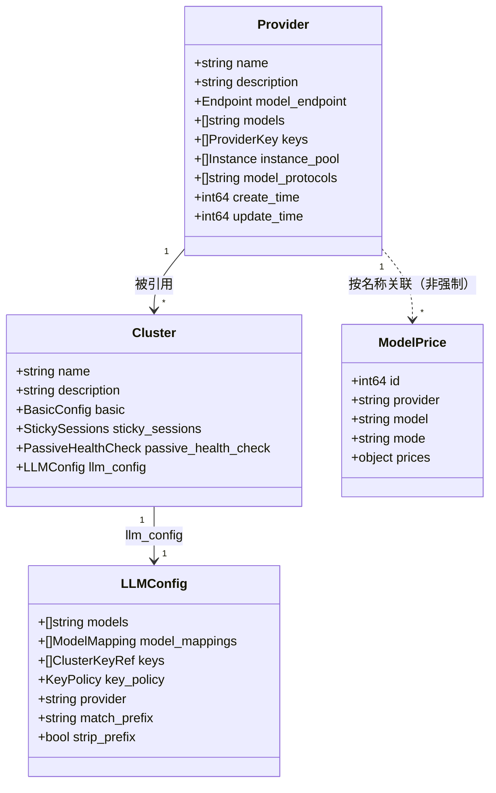

# `/model-prices` 与 `/providers` 解耦及新增 provider 列表接口——设计变更说明

## 1. 概念定义更新

| 概念 | 原定义 | 新定义 |
|------|--------|--------|
| **Model Price** | 一个 (provider, model, mode) 的价格记录，`provider` 必须引用已存在的 provider。 | 一个 (provider, model, mode) 的价格记录，`provider` 仅作为价格归集标识，不强制引用 `/providers` 中已存在的 provider。 |

## 2. 数据模型变更

### 2.1 `/model-prices` 中 `provider` 字段

| 属性 | 变更前 | 变更后 |
|------|--------|--------|
| 合法性条件 | 必填；非空；长度 1-255；必须引用 `/providers` 中已存在的 provider | 必填；非空；长度 1-255；仅作为价格归集标识，不强制校验在 `/providers` 中存在 |
| 与 `/providers` 关系 | 强引用 | 弱引用（按名称关联） |

### 2.2 对 `model-list.yaml` 的影响

- 变更前：导入时 `provider` 必须对应已存在的 provider，否则作为 error 返回并跳过。
- 变更后：导入时不再校验 provider 存在性，未知 provider 可正常写入。

## 3. 存储层变更

### 3.1 `model-prices` 表

- 变更前：增加 provider 外键/引用校验（或在校验层实现）。
- 变更后：移除或不再增加 provider 外键/引用校验；如已存在外键，应降级为普通索引或仅保留查询用途。

### 3.2 `providers` 删除检查

- 变更前：删除 provider 时检查 `/clusters` 和 `/model-prices` 是否引用。
- 变更后：仅检查 `/clusters` 引用；`/model-prices` 不再作为阻塞条件。

## 4. 新增查询能力

### 4.1 `GET /model-prices/actions/get-providers`

**实现要点**

1. 在 `storage/rdb/model-prices` DAO 层新增聚合查询：
   ```sql
   SELECT DISTINCT provider FROM model_prices
   ORDER BY provider;
   ```
2. `model/<domain>/`（model-prices 对应 manager）封装业务逻辑，返回去重后的 provider 名称列表。
3. `endpoints/openapi_v1/<domain>/` 新增 handler 并注册路由。

**性能考虑**

- `provider` 字段上建议保留普通索引，以支持去重聚合查询的性能。
- 若数据量较大，可考虑对结果做缓存或分页；首期按简单列表返回。

## 5. 配置流程变更

变更前：

```
/providers → /model-prices → /clusters → 路由规则（强制顺序）
```

变更后：

```
/providers → /model-prices → /clusters → 路由规则（推荐顺序）
```

- `/model-prices` 与 `/providers` 之间为弱引用关系，实际配置时无需等待 `/providers` 数据就绪即可写入 `/model-prices`。

## 6. 数据迁移方案调整

在 `2026-08-22-provider-cluster-separation` 的自动迁移策略中，第 5 步原为：

> 更新 `model-prices` 中 `provider` 字段，确保对应 provider 存在。

调整为：

> `model-prices` 中 `provider` 字段保持原值，不再强制要求对应 provider 存在。

## 7. 对象关系图（更新后）



**关系说明**

- 一个 `Provider` 可被多个 `Cluster` 引用（强引用，保持不变）。
- 一个 `Provider` 的名称可被多个 `ModelPrice` 记录使用，但 `ModelPrice` 不强制引用已存在的 `Provider`。
- `Cluster` 通过 `llm_config.provider` 关联 `Provider`，并只保留“转发策略”。

## 8. 风险与注意事项

| 风险 | 影响 | 缓解措施 |
|------|------|----------|
| 历史 price 记录与实际 provider 脱节 | 成本计算时可能找不到对应 provider 的 metadata | 通过 `GET /model-prices/actions/get-providers` 与 `GET /providers` 对比，定期识别并补录缺失 provider。 |
| 删除 provider 后 price 记录孤立 | 同名 price 记录仍存在，但底层 provider 能力已消失 | 在管理界面提示“该 price 对应的 provider 不存在”；不影响现有 price 数据。 |
| 弱引用导致数据清理困难 | 无法通过级联删除清理 price 记录 | 如需清理，提供按 provider 名称批量删除/归档 model-prices 的能力。 |
