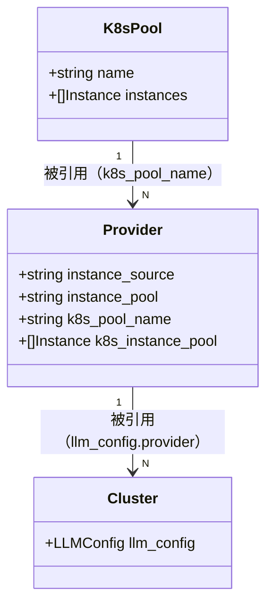

# K8s 场景下 Provider 实例池维护：设计变更说明

## 1. 概念定义

| 概念 | 定义 |
|------|------|
| **实例供给方式（instance_source）** | provider 实例成员的来源：`instance_pool`（人维护，默认）/ `k8s_pool`（发现组件维护） |
| **K8s 池（k8s_pools）** | 控制面内独立资源，成员列表的唯一写入方是发现组件（经 `/k8s_pools` InnerAPI）；provider 侧为只读镜像 |
| **有效池（effective pool）** | provider 对外暴露的实例集合：`source==k8s_pool ? k8s_instance_pool : instance_pool`。syncer、cluster 快照、导出等一切下游的唯一消费口径 |
| **所有权边界** | "创建归人、成员归发现"：provider 资源由人创建；K8s 池成员对控制台只读，摘流等运维动作走 K8s 侧手段（摘 endpoint/打标签） |

## 2. 数据模型变更

### 2.1 Provider 模型扩展（`model/iprovider/provider.go`）

| 字段 | Provider（响应） | ProviderParam（请求） | 说明 |
|------|------------------|----------------------|------|
| `instance_source` | `string` | `*string` | P0 落地；缺省 `instance_pool`；P0 仅接受 `instance_pool`（`k8s_pool` 返回 422），P1 放开枚举 |
| `k8s_pool_name` | `*string` | `*string` | P1 新增；`k8s_pool` 模式必填，普通名称校验 |
| `k8s_instance_pool` | `[]ProviderInstance` | `*[]ProviderInstance` | P1 新增；只读镜像，请求出现即 422 |

校验改造（`validateProviderInstancePool` `provider.go:778-805` 及创建/更新入口 `:468`）：现有规则（≥1、`(addr,port)` 去重、≥1 个 `weight>0`）在 `instance_pool` 模式下**原封不动**；P0 纯粹是结构上为 P1 腾出条件分支。合法空池只出现在 `k8s_pool` 模式。

### 2.2 K8s 池模型（新增 `model/ik8s_pool/` + `storage/rdb/k8s_pool/`）

- `k8s_pools` 表：`name` 唯一键、`instances` JSON、`created_at`/`updated_at`。
- 池与 provider 基数允许 N:1：实例列表只存一份在 `/k8s_pools`，provider 侧为只读镜像。
- 发现实例默认 `weight=100`、`disable=false`（controller 只上报就绪端点）。

### 2.3 对象关系

## 3. 有效池机制（P0 落结构，P1 落分支）

抽出 `effectiveInstancePool(p *iprovider.Provider) []ProviderInstance`：

- P0：有效池 ≡ `InstancePool`（函数内只有默认分支，调用点零变化）；
- P1：函数内加入 `k8s_pool` 分支（返回 `k8s_instance_pool`），调用点零改动。

消费点清单（P1 全部改读有效池）：

| 消费点 | 位置 |
|--------|------|
| cluster 创建引用 provider 时的 pool/sub-cluster 快照 | `model/icluster_conf/cluster.go:491` |
| provider 更新时同步引用 cluster 的派生池（syncer） | `cluster.go:899-930` |
| 实例池相等比较（升级为先比较有效池） | `model/iprovider` |

## 4. syncer 空池语义改造（P0-2，`model/icluster_conf/cluster.go`）

现状：`ProviderInstancePoolSyncer` 对空池早退（`cluster.go:906`：`len(newProvider.InstancePool) == 0 { return }`），该路径当前被必填校验保护而不可达。

改造后：

- 删除早退；计算 old/new provider 的**有效池**；
- 有效池相等 → return；否则对引用 cluster 的每个 sub-cluster `UpdatePool(Instances: 有效池)`——**包括空列表**（清空语义）；
- 实现核查点：`poolStorager.UpdatePool` 需接受空 `Instances`（JSON 列写入 `[]`，实现时验证）；
- `cluster.go:491` 创建路径同步改为取有效池。

**空池数据面行为（BFE 侧已查证）**：导出为空条目、BFE 加载接受（前提：维持"发空条目"导出语义；若改为省略整个 cluster，BFE `backendInit` 命中 `no backend conf` 导致整表 reload 失败）、该 cluster 请求 500（`BK_NO_BACKEND`），由告警覆盖。EPP 模式实例池为空只影响本地兜底，同样表现为无后端时 500。

## 5. `/k8s_pools` 同步事务（P1，`model/ik8s_pool/`）

PUT 与 DELETE 共用 fan-out，须在 `itxn` 单事务内：

1. 写 `k8s_pools` 行（PUT 更新 instances / DELETE 删行）；
2. 查出所有 `instance_source=k8s_pool && k8s_pool_name==name` 的 provider；
3. 逐个刷新其 `k8s_instance_pool`（PUT → 新列表；DELETE → `[]`）；
4. 逐个触发 cluster 派生池同步——复用 §4 抽出的同步函数：从 `ProviderInstancePoolSyncer` 的 hook 体中提取 `syncProviderEffectivePool(ctx, old, new)`，hook 与本 manager 共用；
5. cluster_table version 由 `ExportConfig` MD5 签名机制（`model/iversion_control/version_control.go:84-111`）在下次导出自动 bump，无需手工干预。

依赖注入：manager 依赖 `itxn.TxnStorager`、provider storager、`ClusterManager`，禁直连 `stateful.Default*`。

## 6. 导出侧

`model/icluster_conf/exporter.go` **无需改动**：空池 skip + 空条目下发的既有语义正是所需。这也维持了 BFE 加载期接受空池的前提（§4）。

## 7. 数据库变更

| 表 | 变更 | 分期 | 文件 |
|---|------|------|------|
| `providers` | 加 `instance_source` VARCHAR(32) NOT NULL DEFAULT 'instance_pool' | P0 | `db_ddl.sql`、`db_ddl_sqlite.sql` |
| `providers` | 加 `k8s_pool_name` VARCHAR(255) NULL、`k8s_instance_pool` JSON NULL | P1 | 同上 |
| `k8s_pools` | 新表（`name` 唯一键、`instances` JSON、`created_at`/`updated_at`） | P1 | 同上 |

存量行取默认值即现状，零数据迁移；P0 只落 `instance_source` 一列，避免两次 DDL 迁移。

## 8. 错误处理与边界

| 场景 | 行为 |
|------|------|
| P0 传 `instance_source=k8s_pool` | 422 |
| 任意模式请求体带 `k8s_instance_pool` | 422（只读字段） |
| `instance_pool` 模式空池 / `k8s_pool` 模式缺 `k8s_pool_name` | 422（切换时点校验，休眠字段除外） |
| provider 引用尚不存在的 pool | 允许；`k8s_instance_pool` 为空直至首次 PUT（池不存在 ≡ 零实例） |
| DELETE 被引用的 pool | 允许；引用者镜像置空、cluster 派生池清空（事务内） |
| 空池被 cluster 引用 | 导出空条目、BFE 加载接受、请求 500（`BK_NO_BACKEND`），由告警覆盖 |
| PUT `/k8s_pools/{name}/instances` 部分失败 | 整个事务回滚（fan-out 在单事务内） |
| provider 收缩 `instance_pool`（k8s 模式下 PATCH 休眠字段） | 不触发同步；切回 `instance_pool` 模式时经 syncer 走有效池变化同步 |
| PATCH 切换到 `instance_pool` 模式时 provider 已有同步过的镜像 | 系统在同一更新里强制清空 `k8s_instance_pool`（契约：该模式下镜像恒为空数组）；镜像刷新始终专属 `/k8s_pools` 写入通道，切回 `k8s_pool` 模式后由下一次 PUT fan-out 重新填充 |

## 9. 测试

- **单测**（`make test-model` + 70% 覆盖率门禁）：
  - `iprovider`：条件校验全分支（含模式切换、`k8s_instance_pool` 422）；
  - `icluster_conf`：syncer 空池清空、有效池分支；
  - `ik8s_pool`：fan-out（PUT/DELETE、N:1 多 provider、零引用）；
  - endpoint 参数校验。
  - mock 沿用 callback fake 模式（`AGENTS.md`）。
- **集成测试**（`test/integration/tests/provider/` 新增 k8s_pool 用例目录）：PUT pool → 建 `k8s_pool` 模式 provider → 镜像出现 → cluster 引用 → 导出含实例 → 再 PUT 增删实例 → 导出跟随 → DELETE pool → 镜像清空、导出空条目。
- **回归**：存量 `create` / `partial_update` 用例全绿（默认模式行为零变化）。

## 10. 关键文件索引

| 文件 | 改造点 |
|------|--------|
| `model/iprovider/provider.go` | 结构体三字段、`validateProviderInstancePool` 条件化、422 规则 |
| `model/icluster_conf/cluster.go` | `:906` 早退删除、`:491`/syncer 改读有效池、抽 `effectiveInstancePool` / `syncProviderEffectivePool` |
| `model/ik8s_pool/`（新）+ `storage/rdb/k8s_pool/`（新） | pool 域 manager/DAO/事务 fan-out |
| `endpoints/innerapi_v1/k8s_pools/`（新）+ `endpoints/innerapi_v1/endpoints.go` | 四端点实现与注册 |
| `endpoints/openapi_v1/provider/` | create/update 参数与错误码透传（校验在 model 层） |
| `db_ddl.sql` / `db_ddl_sqlite.sql` | `providers` 加列、`k8s_pools` 新表 |
| `design-docs/api-define/OpenAPI接口定义/providers.md` | 字段/校验/示例 |
| `design-docs/api-define/InnerAPI接口定义/k8s-pools.md`（新）+ `02-interface-list.md` | InnerAPI 契约 |
| `test/integration/tests/provider/` | k8s_pool 集成用例 |

## 11. 风险与注意事项

| 风险 | 影响 | 缓解措施 |
|------|------|----------|
| 空池下发后该 cluster 请求 500 | K8s 实例尚未就绪或全部被摘除期间，命中该 cluster 的流量失败 | 空池告警（provider 引用 k8s_pool 但镜像持续为空 N 分钟）；等待实例就绪是 K8s 场景的固有状态 |
| `poolStorager.UpdatePool` 不接受空 `Instances` | syncer 清空语义无法落地 | 实现期首先验证（预期 JSON 列写入 `[]` 无阻碍）；如有阻碍在 DAO 层适配 |
| 一致性链路变长 | K8s 事件 → 发现组件 → `/k8s_pools` → provider 镜像 → cluster 派生池 → version bump → 数据面，每跳都是最终一致窗口 | `/k8s_pools` 条目暴露 `instance_count` + `last_sync_time`，排查"实例在 K8s 里有了、流量为什么没到"有抓手 |
| P0/P1 两期交付 | 期中间 `k8s_pool` 不可用 | P0 传 `k8s_pool` 显式 422，不留半开状态 |
